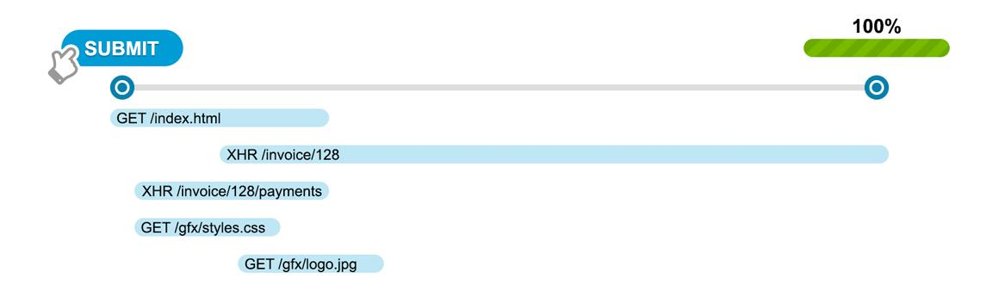

::: slot snippet
* Website performance monitoring snippet that gathers loading timings of resources on the page
* Full support for dynamic websites & SPAs without any framework-specific configuration
* Testing across different browsers using selenium grid & combination of docker & virtual machines (IE 11)
* Basic test apps in multiple frameworks to ensure support across frameworks
:::

::: slot images
<images-gallery>

</images-gallery>
:::
