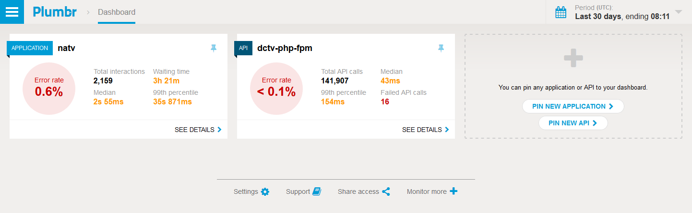
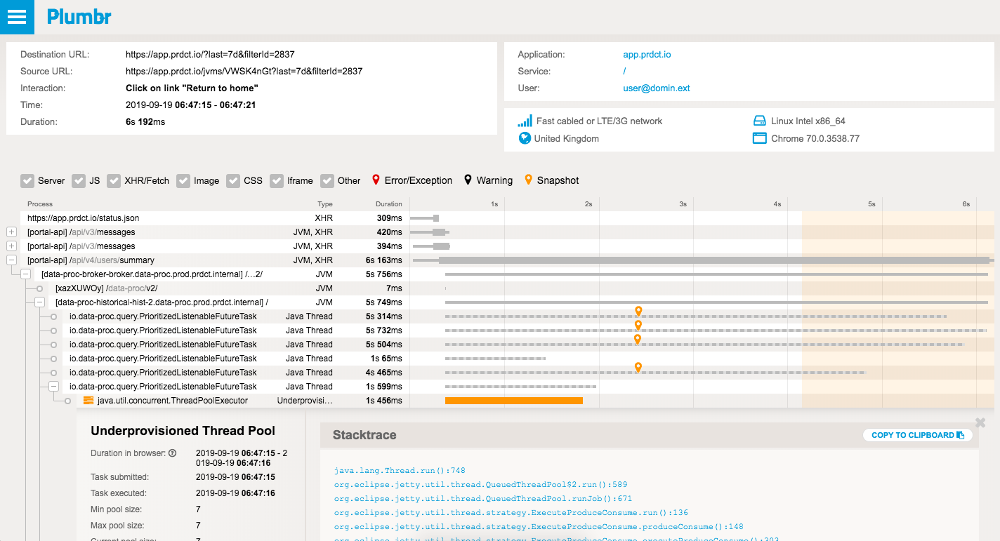
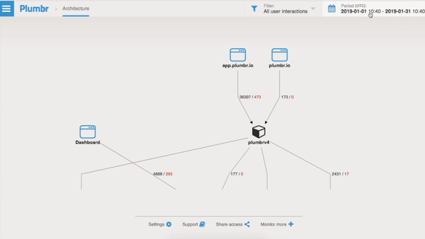

::: slot snippet
* Development on the primary UI of the product
* Tooling from gulp scripts to full webpack configuration
* Incremental conversion from AngularJS to Vue.js after it became phased out
:::

::: slot images
<images-gallery>

</images-gallery>
:::
