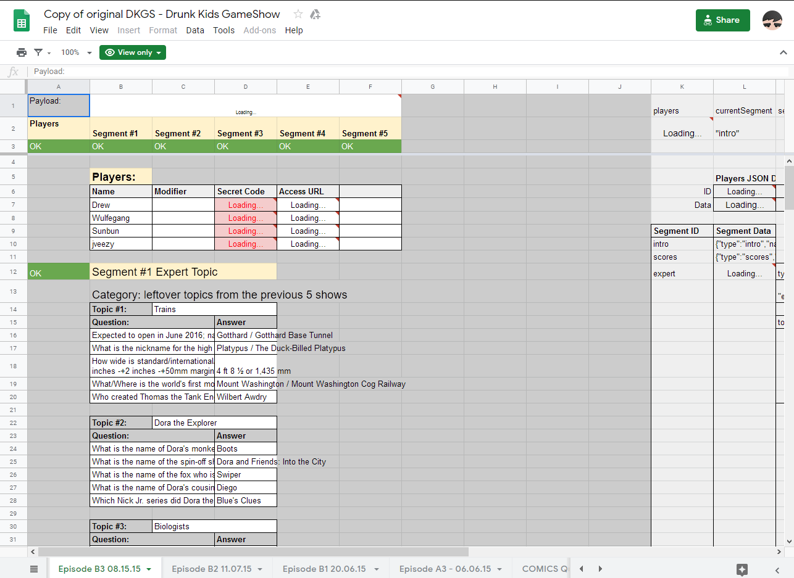
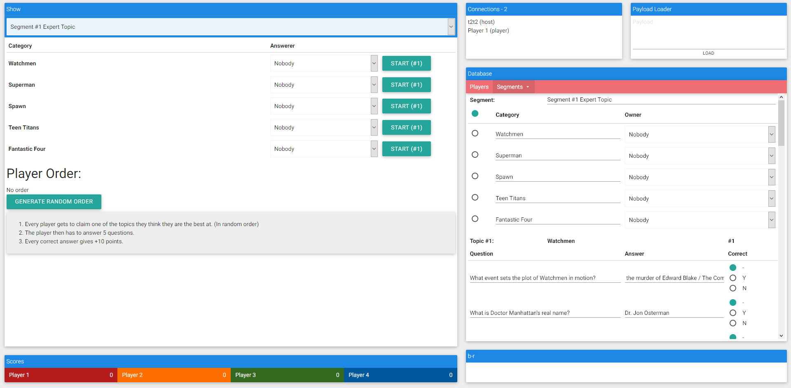
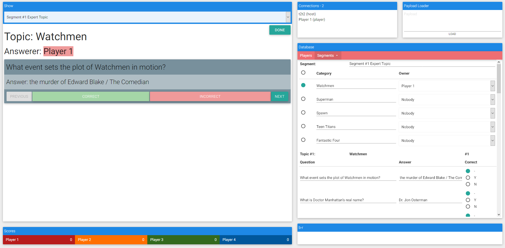
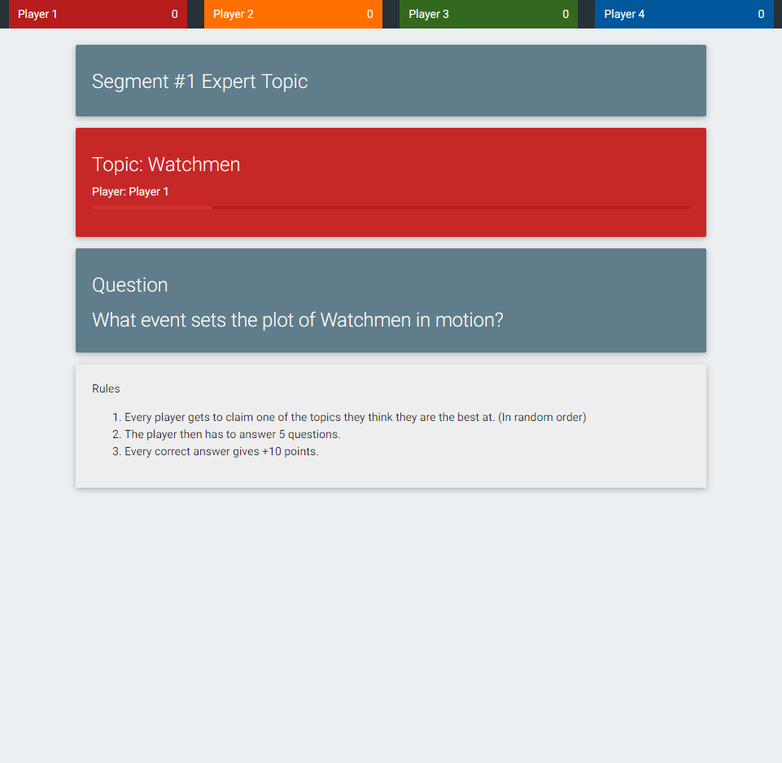
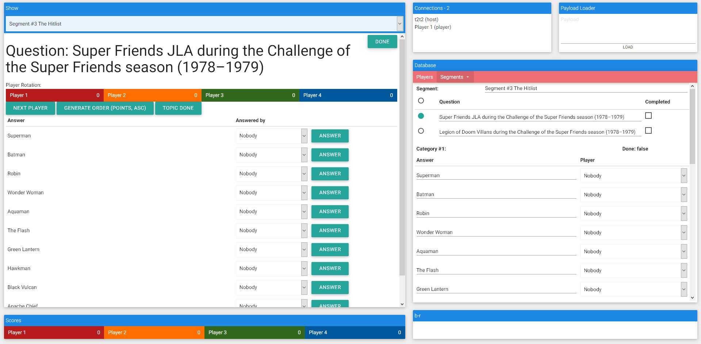
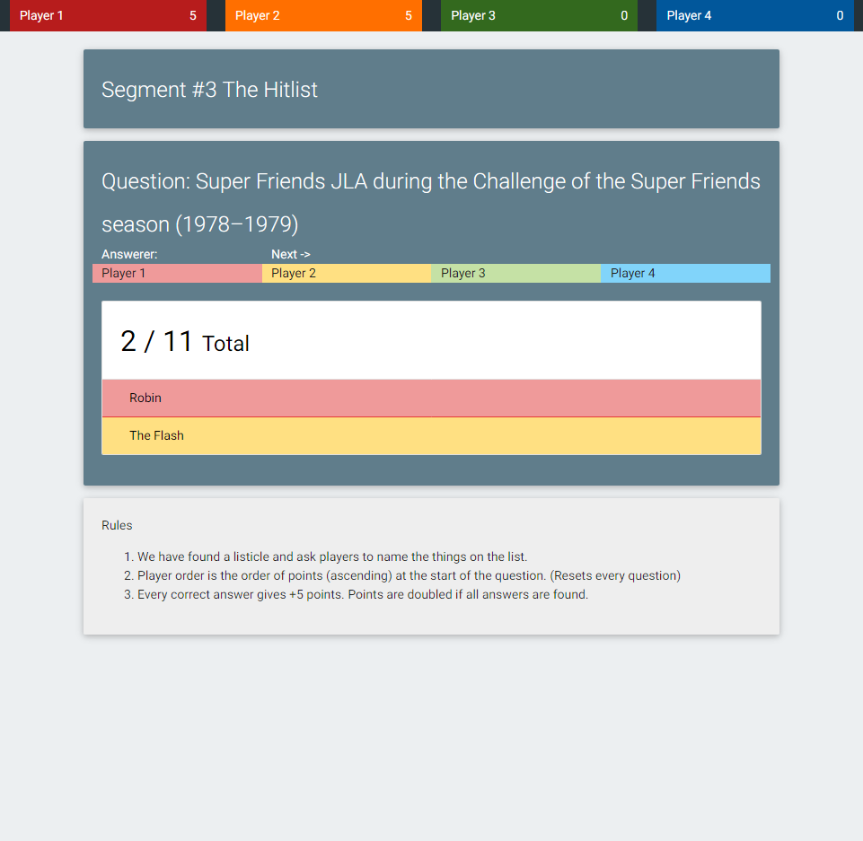
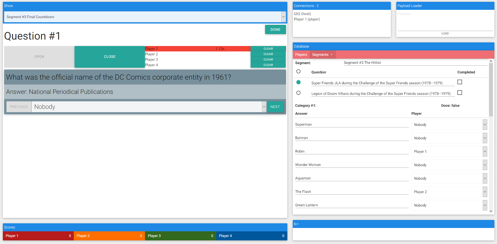
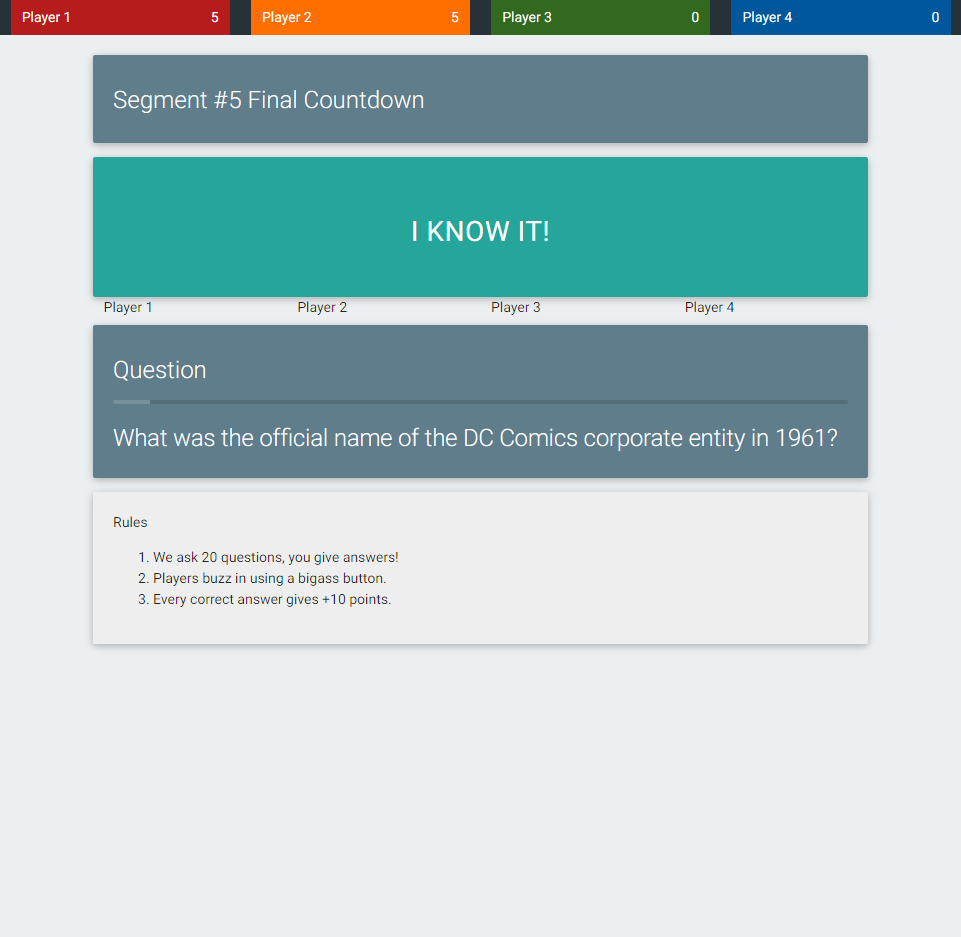
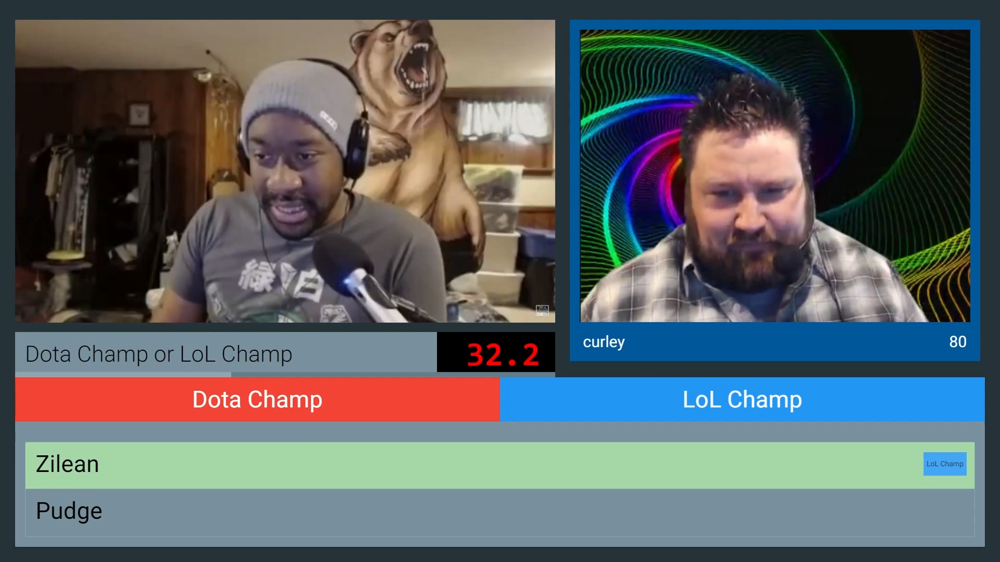

::: slot snippet
* Gameshow made for twitch livestream featuring full interface for hosts, players and video overlay
* Video overlay based on active OBS scene and segment of the show
* Died after google spreadsheets couldn't generate the json configurations used by the show anymore (could have optimised it by a lot)

[Video of episodes](https://www.youtube.com/user/itst2t2/search?query=DKGS) (May include crude language)
:::

::: slot images
<images-gallery>

</images-gallery>
:::
