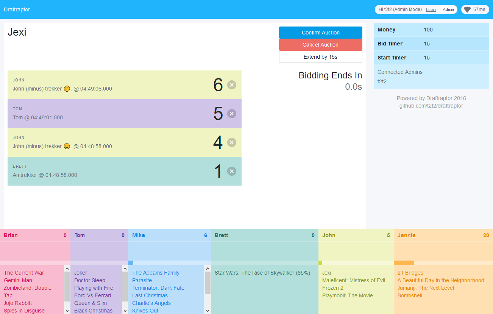
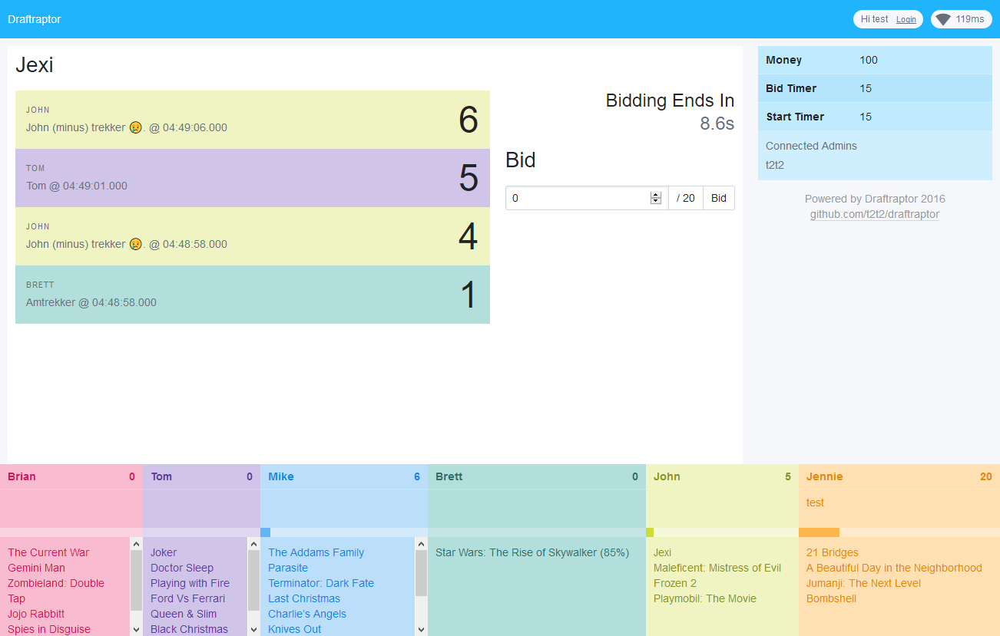

::: slot snippet
* Web app for auctioning off items in an auction format fantasy game
* Real time bidding over websockets that supports multiple players per team
* Extra support for % share of ownership when bid hits the maximum amount of money

[Video of it in use](https://youtu.be/i15_97t3Gjg?t=417)
:::

::: slot images
<images-gallery>

</images-gallery>
:::
