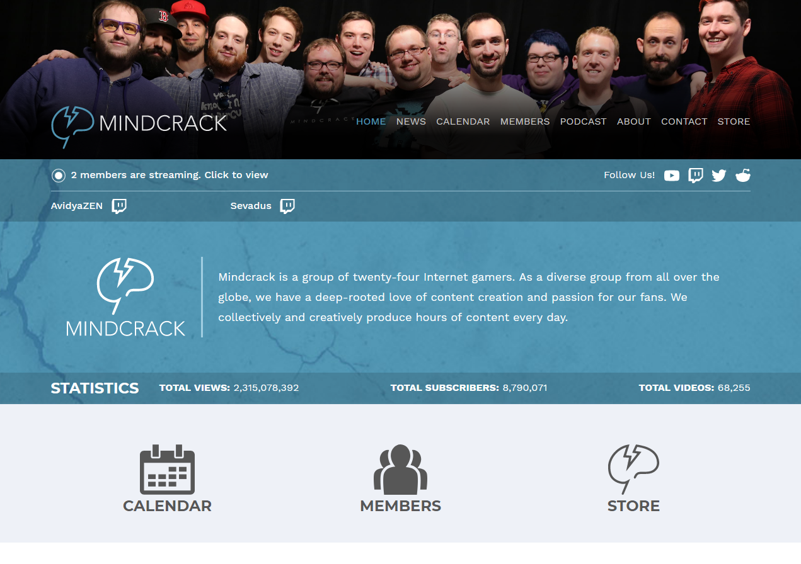
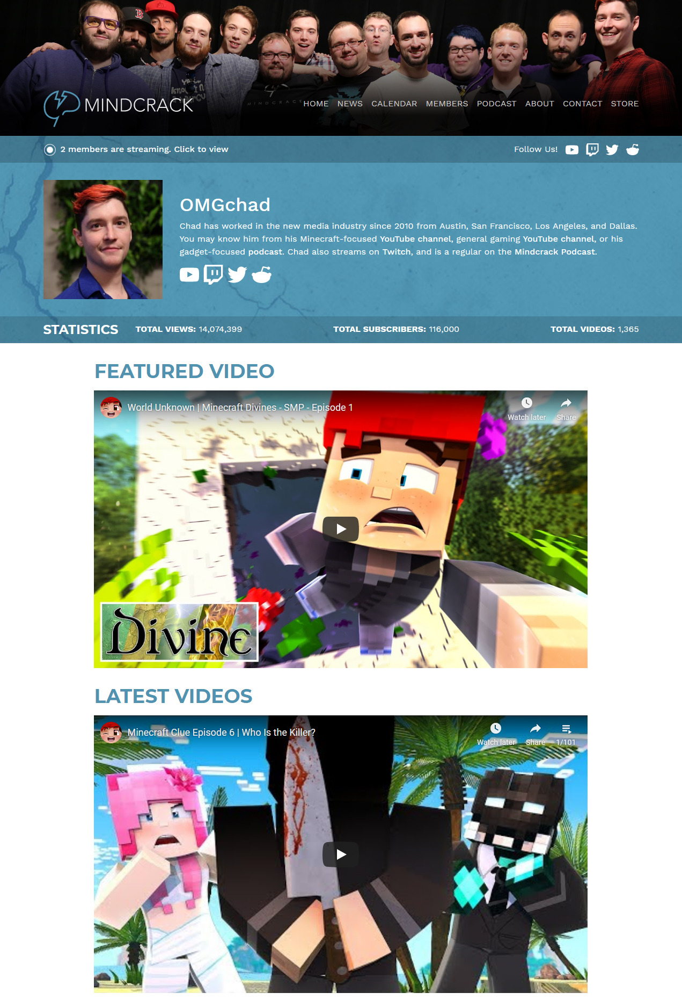

::: slot snippet
* Homepage for youtube content network Mindcrack
* CMS configuring (content types), automatic updating youtube views/subscribers/videos numbers (per person and total), webpack setup
* Design by [Matthew Fraser](http://matthewfraser.ca/)
:::

::: slot images
<images-gallery>

</images-gallery>
:::
