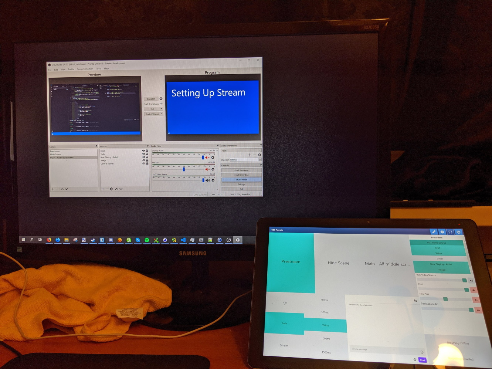
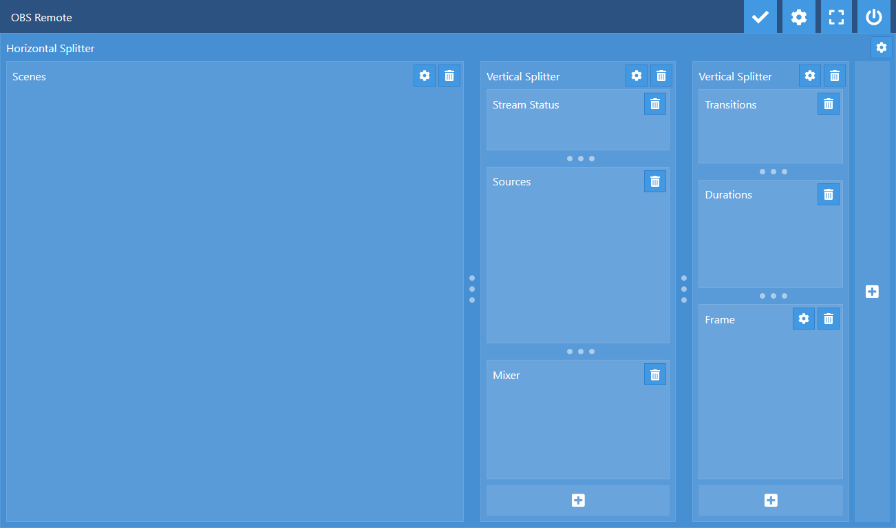

::: slot snippet
* Web app to control OBS (Open Broadcaster Software) from other devices using [obs-websocket](https://github.com/Palakis/obs-websocket)
* User interface optimised for touch devices (tablet, phone), inspired by video switching hardware controls used in real studios
:::

::: slot images
<images-gallery>

</images-gallery>
:::
