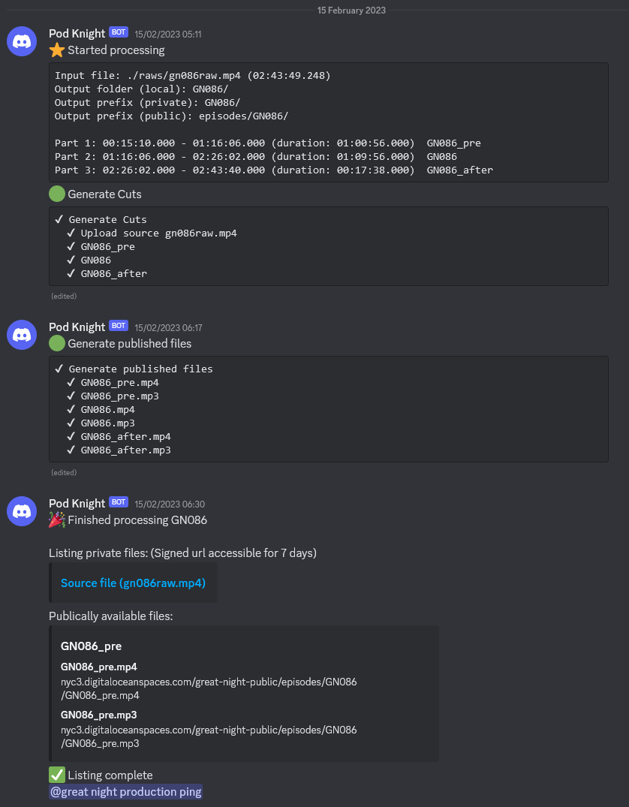

::: slot snippet
* Custom CLI tool to cut a live stream recording into shorter clips using ffmpeg, generating podcast optimised files and uploading them to S3-compatible storage
* Automatically posts status updates to discord via a webhook, allowing for fully-remote teams to know when files are ready
:::

::: slot images
<images-gallery>

</images-gallery>
:::
